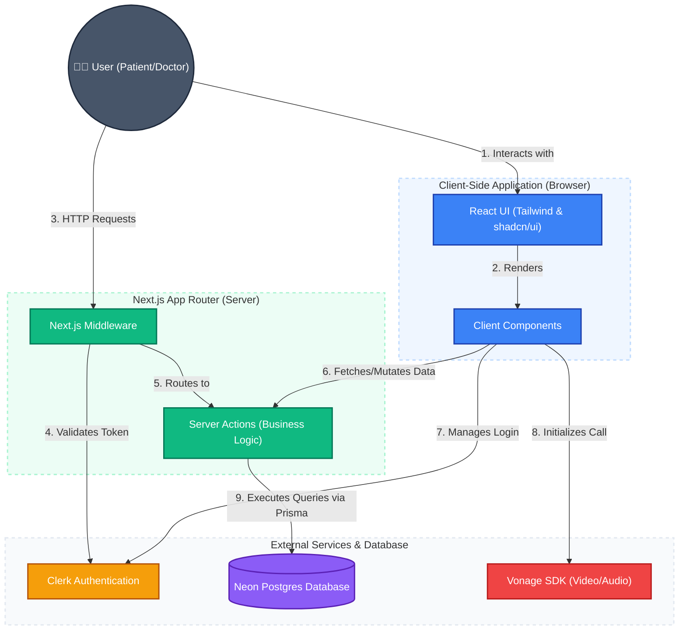

# CareConnect System Architecture

This document provides an in-depth look at the architecture of the CareConnect platform. The application is designed to be highly secure, scalable, and responsive, utilizing a modern Full-Stack Next.js architecture.

## 🎨 Architecture Diagram

Below is a detailed, colorful breakdown of the system components and how they interact with each other.

---

## 🔍 Step-by-Step Architecture Breakdown

### 1. User Interaction & Client Layer (Blue)
The frontend of the application is built entirely using **Next.js App Router** with React.
- When a user (Doctor or Patient) visits the app, the browser downloads the Client Components.
- The UI is styled elegantly using **Tailwind CSS** and **shadcn/ui**.
- State is managed via React hooks (e.g., `useState`, `useEffect`, and custom hooks like `useFetch`).

### 2. Authentication & Middleware (Orange & Green)
Security is handled at the edge using Next.js Middleware and **Clerk**.
- Whenever the user attempts to access a protected route (like the Dashboard or Appointments page), the HTTP request first hits the **Next.js Middleware**.
- The Middleware communicates with **Clerk Auth** to verify the user's JSON Web Token (JWT).
- If the token is invalid or missing, the user is immediately redirected to the sign-in page, ensuring that unauthorized users can never access the Server Actions or the Database.

### 3. Server Actions & Business Logic (Green)
Instead of building traditional REST APIs (like `/api/getAppointments`), this project utilizes **Next.js Server Actions**.
- When the user submits a form (e.g., setting availability or booking an appointment), the Client Component calls a Server Action function directly.
- These Server Actions run securely on the server environment. This means secrets (like Database URLs and Vonage private keys) never leak to the client's browser.
- Server Actions handle all the business logic, input validation, and role verification (checking if a user is an ADMIN, DOCTOR, or PATIENT).

### 4. Database Layer (Purple)
The application's data is stored in **Neon**, a Serverless Postgres Database.
- The Server Actions communicate with the Neon database via **Prisma ORM**.
- Prisma ensures that all database queries are type-safe. It reads and writes data (users, appointments, availability slots, and credit transactions) smoothly without the need to write raw SQL.

### 5. Third-Party Integrations (Red)
Real-time capabilities are powered by the **Vonage SDK**.
- When a patient and doctor are ready for their scheduled appointment, the client-side application securely connects to Vonage.
- This establishes a WebRTC-powered video/audio communication channel directly between the two users' browsers, allowing for seamless telehealth consultations.
