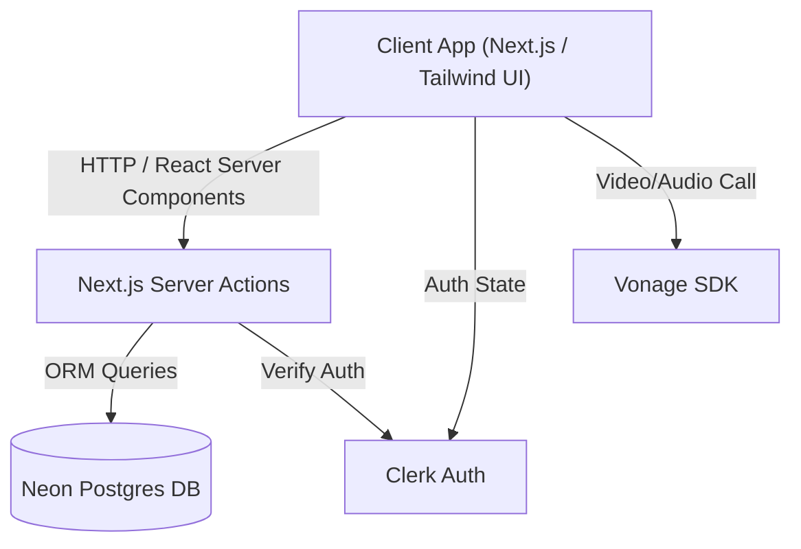

# CareConnect

CareConnect is a modern healthcare platform built to bridge the gap between patients and medical professionals. It enables patients to easily book appointments, consult with doctors, and manage their health journey. For doctors, it provides tools to manage their availability, handle appointments, and track earnings.

## 🚀 Features

### For Patients
- **Find Specialists:** Browse through a list of certified doctors by specialty.
- **Book Appointments:** Real-time scheduling based on the doctor's availability.
- **Consultations:** Integrated communication and seamless meeting experiences (powered by Vonage).
- **Credits System:** Manage your platform credits to book appointments efficiently.

### For Doctors
- **Availability Management:** Set your daily working hours seamlessly. 
- **Appointment Tracking:** View upcoming, completed, and canceled appointments.
- **Payouts Dashboard:** Track earnings (credits) and request payouts.

### For Admins
- **Manage Payouts:** Review and approve doctor payout requests securely.

## 🛠️ Tech Stack

- **Framework:** [Next.js 16](https://nextjs.org/) (App Router)
- **Styling:** [Tailwind CSS 4](https://tailwindcss.com/) & [shadcn/ui](https://ui.shadcn.com/)
- **Authentication:** [Clerk](https://clerk.com/)
- **Database:** [Neon (Serverless Postgres)](https://neon.tech/)
- **ORM:** [Prisma ORM](https://www.prisma.io/)
- **Communication:** [Vonage SDK](https://www.vonage.com/)
- **Forms & Validation:** React Hook Form & Zod

## 🏗️ Architecture & How It Works

CareConnect uses a modern Full-Stack Next.js architecture (App Router) combined with Server Actions for secure and seamless data fetching.



- **Frontend:** Built with Next.js App Router, using Server Components for performance and Client Components for interactivity. UI is styled with Tailwind CSS and shadcn/ui.
- **Authentication:** Clerk handles user sessions securely via `middleware.js`, protecting both client pages and Server Actions.
- **Backend / Database:** Next.js Server Actions act as the backend API, securely querying the Neon Serverless Postgres database using Prisma ORM.
- **Real-Time Consultations:** The Vonage SDK integrates directly into the client to enable seamless patient-doctor video/audio consultations.

## 📂 Folder Structure

```text
CareConnect/
├── actions/         # Server Actions (Next.js backend logic)
├── app/             # Next.js App Router (Pages, Layouts)
│   └── (main)/      # Main application routes (Dashboard, Appointments, etc.)
├── components/      # Reusable UI Components (shadcn/ui, custom components)
├── hooks/           # Custom React hooks (e.g., useFetch)
├── lib/             # Utility functions and Prisma Client setup
├── prisma/          # Database Schema and Migrations
├── public/          # Static assets (images, icons)
├── .env.example     # Example environment variables
├── middleware.js    # Clerk Authentication middleware
└── package.json     # Project dependencies and scripts
```

## ⚙️ Getting Started

### Prerequisites
Make sure you have [Node.js](https://nodejs.org/) installed on your machine.

### Installation

1. **Clone the repository:**
   ```bash
   git clone https://github.com/your-username/CareConnect.git
   cd CareConnect
   ```

2. **Install dependencies:**
   ```bash
   npm install
   ```

3. **Set up Environment Variables:**
   Rename the `.env.example` file to `.env` and fill in your keys:
   ```bash
   cp .env.example .env
   ```
   *Note: You will need API keys for Clerk, Vonage, and a connection string for Neon Database.*

4. **Initialize the Database:**
   ```bash
   npx prisma generate
   npx prisma db push
   ```

5. **Run the development server:**
   ```bash
   npm run dev
   ```
   Open [http://localhost:3000](http://localhost:3000) with your browser to see the application in action.

## 🤝 Contributing
Contributions, issues, and feature requests are welcome! Feel free to check the issues page if you want to contribute.
